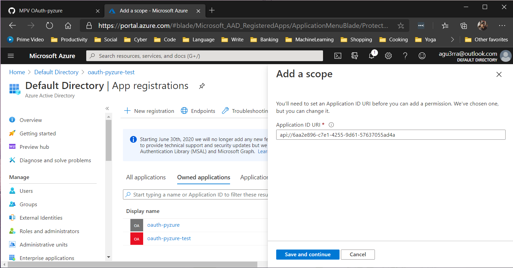

# OAuth Pyzure
A Python library for using and validating OAuth's [client credentials](https://www.oauth.com/oauth2-servers/access-tokens/client-credentials/) grant type (API to API) in Azure.

<!-- TOC -->

- [OAuth Pyzure](#oauth-pyzure)
    - [Install](#install)
    - [Usage](#usage)
- [Setup your API on Azure](#setup-your-api-on-azure)

<!-- /TOC -->

## Install
> $ pip install oauth-pyzure

## Usage
```python
from oauth_pyzure import OAuth

"""
Instantiate an object and give it the Azure tenant id of your application.
"""
oa = OAuth(tenant_id='some_tenant_id')

"""
Use this if you already have a registered an app in AzureAD and wish to obtain
a JSON Web Token
"""
jwt = oa.get_token(
    client_id='some_client_id',
    client_secret='some_client_secret_you_wont_commit_to_scm',
    scope='api://someappid/.default'
)

"""
Use this if you are implementing OAuth in your API and wish to obtain the 
claims and validity of a jwt. 

Upon recognition of a valid token, claims will be a dictionary containing all
the claims in the token and error will be set to None.

If any error occurs, it will be saved to the error
string and claims will be set to None.
"""
(claims, error) = oa.get_claims(jwt, app_id)
```

# Setup your API on Azure
Do not forget that in order for the client-credentials flow to work, a target application needs to be setup in *Azure Active Directory > App Registration* and the appropriate scope needs to be set for it. Example below:


